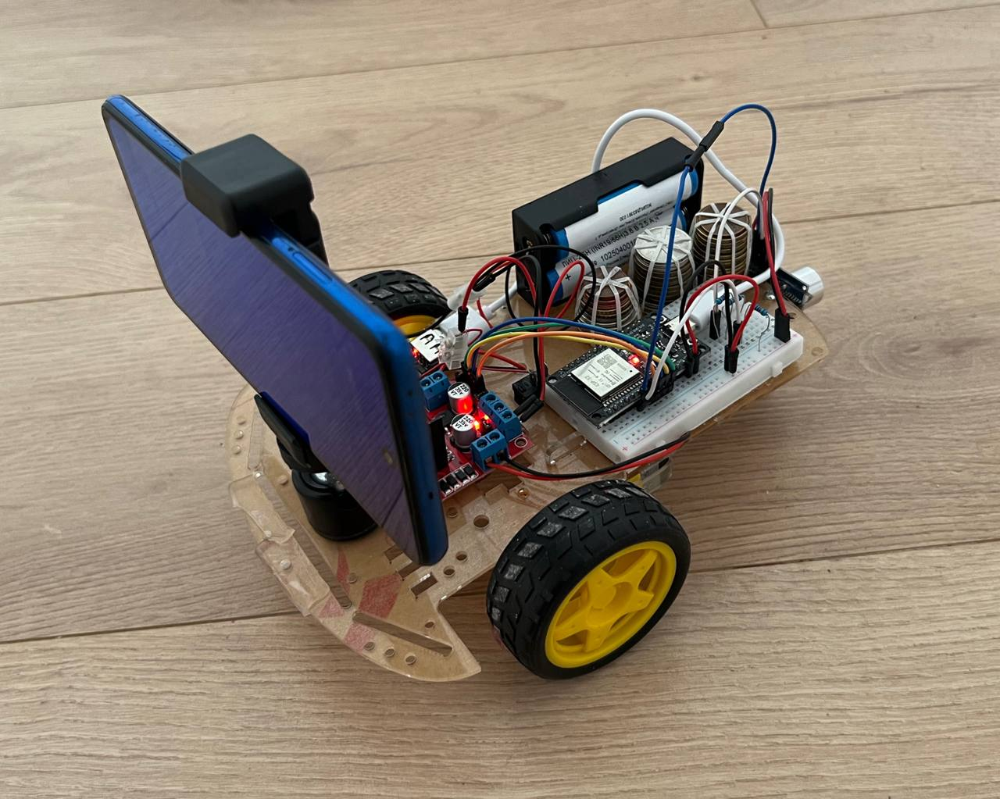

# Autonomous Robot with Computer Vision Navigation

An autonomous mobile robot that uses computer vision to detect visual markers (ArUco) and navigate to target locations while avoiding obstacles. The system combines embedded motor control on an ESP32 microcontroller with advanced CV logic and path planning on a host computer, communicating via WiFi.

## Project Overview

This project demonstrates a distributed robotics system where:
- **ESP32 microcontroller**: Manages motor control, distance sensing, and WiFi communication
- **Host computer**: Runs computer vision analysis, target detection, and navigation logic
- **IP Webcam**: Provides real-time video feed from an Android phone (using IPWebcam app)

The robot autonomously searches for visual markers, approaches them while avoiding obstacles, and executes commands received from the host computer.



## Hardware Architecture

### System Components

#### Power Supply
- **2× 18650 Batteries** (3.6V, 2.5A each)
  - Connected in series via battery case to provide ~7.2V
  - Positive terminal connects through a switch
  - Negative terminal connects to a common ground connector

#### Motor System
- **2× Yellow Gear Motors** 
  - Directly connected to the robot's wheels
  - Controlled via L298N motor driver
  
- **L298N Motor Driver**
  - Accepts battery voltage (up to 12V)
  - 4 outputs to the motors
  - Ground connected to common ground
  - Power connected through main switch
  - Control pins: IN1 (GPIO 18), IN2 (GPIO 19), IN3 (GPIO 21), IN4 (GPIO 22)

#### Voltage Regulation
- **DC-DC Step-Down Converter**
  - Input: Up to 12V from battery
  - Output: 5V via USB-A connector
  - Powers the ESP32 microcontroller via USB-C cable

#### Microcontroller
- **ESP32 Dev Board**
  - Powered via 5V USB from step-down converter
  - **Motor Control Pins**: GPIO 18, 19, 21, 22 (connected to L298N IN1-IN4)
  - **Distance Sensor**: TRIG on GPIO 32, ECHO on GPIO 35
  - **WiFi Module**: Built-in (STA mode, connects to home router)

#### Obstacle Detection
- **HC-SR04 Ultrasonic Distance Sensor**
  - Power & Ground: Connected via wire wrap to sensor pins
  - TRIG Pin: GPIO 32
  - ECHO Pin: GPIO 35 (via voltage divider: 10k Ω → 10k Ω + 10k Ω to GND for 5V→3.3V conversion)

#### Computer Vision
- **IP Webcam** (Android phone with IPWebcam app)
  - Provides MJPEG stream and individual frame snapshots via HTTP
  - Wireless connection on home network
  - Transmits video to host computer for ArUco marker detection

### Wiring Diagram
```
Battery (7.2V)
    ├─ Switch
    ├─ L298N Motor Driver
    │   ├─ Motors
    │   └─ GND → Common Ground
    └─ DC-DC Converter (5V out)
        └─ ESP32 (via USB-C)
            ├─ GPIO 32 (HC-SR04 TRIG)
            ├─ GPIO 35 (HC-SR04 ECHO via voltage divider)
            └─ GPIO 18,19,21,22 (Motor Driver IN1-IN4)

HC-SR04 Ultrasonic Sensor
    ├─ VCC → 5V
    ├─ GND → Common Ground
    ├─ TRIG → GPIO 32
    └─ ECHO → GPIO 35 (via voltage divider)
```

## System Architecture

### High-Level Data Flow

```
IP Webcam (WiFi)
    ↓ (HTTP)
Host Computer (Python)
    ├─ Vision: ArUco Detection
    ├─ Navigation Logic: Target approach, obstacle avoidance
    └─ WiFi (TCP client)
        ↓ (Commands: MOVE, TURN, GET_DISTANCE)
ESP32 Microcontroller (WiFi server)
    ├─ Motor Control (PWM)
    ├─ Distance Reading (HC-SR04)
    └─ Command Executor
        ↓
Robot Motors & LEDs
```

### Communication Protocol

#### WiFi Connection
1. **Microcontroller Setup (STA Mode)**
   - ESP32 connects to home WiFi router as a WiFi client
   - Starts a TCP server listening on a fixed IP and port
   - Waits for client connections

2. **Host Computer Connection**
   - Creates TCP socket to ESP32 server
   - Waits for "ready" message from ESP32
   - Sends UTF-8 encoded commands
   - Receives responses after command execution

#### Command Protocol
Commands are text-based and execute sequentially:

```
HOST → ESP32:
  MOVE <distance_m>      # Move forward (positive) or backward (negative)
  TURN <degrees>         # Turn left (negative) or right (positive)
  GET_DISTANCE           # Query obstacle distance
  
ESP32 → HOST:
  DONE                   # Command execution complete
  <sensor_data>          # Response to queries
```

Each command is fully executed before the next one is accepted. The socket is closed only after all commands are completed and responses received.

## Software Architecture

### Firmware (ESP32)

**Directory**: `firmware/src/`

- `main.cpp` - Main event loop (WiFi polling, sensor updates, motor control)
- `wifi.cpp/h` - WiFi server, client management, command reception
- `motors.cpp/h` - PWM motor control (non-blocking timed movements)
- `commands.cpp/h` - Command parsing and execution
- `utils.cpp/h` - Ultrasonic sensor reading, helper functions
- `config.h` - Pin definitions and configuration constants

### Host Software (Python)

**Directory**: `host/src/`

- `robot.py` - Main robot logic with state machine (SEARCH, SCAN, APPROACH, AVOID, LOST_TARGET, FINISHED)
- `hardware.py` - Abstraction layer: sensor reading, motor commands via WiFi
- `vision.py` - ArUco marker detection using OpenCV
- `schemas.py` - Data structures (RobotState, SensorSnapshot, MarkerDetection)
- `config.py` - Configuration parameters (WiFi address, vision resolution)
- `logger_factory.py` - Logging utilities

**Scripts** (`host/scripts/`):
- `detect_aruco_realtime.py` - Test ArUco detection with live camera feed
- `run_robot.py` - Main entry point for autonomous operation
- `teleop_keyboard_wifi.py` - Manual robot control via keyboard
- `vision_script.py` - Standalone vision testing
- `wifi_send.py` - Low-level WiFi command testing

## Navigation Logic

The robot uses a finite state machine to autonomously navigate:

1. **SEARCH** - Move forward while scanning for markers. After moving for a set duration, transitions to SCAN state to explore surroundings.

2. **SCAN** - Stop and systematically turn left, right, and center to look around. This increases the chances of spotting a marker in different directions. After scanning sequence completes, returns to SEARCH.

3. **APPROACH** - Marker is visible. The robot centers the marker in the camera frame by adjusting heading (turning), then moves forward toward it. Continues until the marker fills enough of the frame (reaches area threshold).

4. **AVOID** - Obstacle detected within safety threshold. Robot backs up, turns left or right alternately to find a clear path, then returns to SEARCH.

5. **LOST_TARGET** - Marker was recently seen but is now out of view. Instead of full exploration, the robot makes small turns in the direction the marker was last seen, searching for it locally. If the marker isn't re-detected within a timeout, it returns to SEARCH.

6. **FINISHED** - Target reached. Marker area exceeds the close approach threshold, indicating successful arrival at the target location. Robot stops execution.

State transitions are checked every iteration based on current sensor data (marker visibility, direction, obstacle distance) and elapsed time in each state.

The host computer continuously:
- Reads camera frames and detects ArUco markers
- Queries ultrasonic distance from ESP32
- Evaluates state transitions
- Executes appropriate motor commands
- Logs all sensor data and state transitions

## Project Structure

```
autonomous-robot/
├── README.md                      # This file
├── firmware/                      # ESP32 C++ code
│   ├── platformio.ini             # PlatformIO configuration
│   └── src/
│       ├── main.cpp               # Main loop
│       ├── commands.cpp/h         # Command parsing & execution
│       ├── motors.cpp/h           # Motor PWM control
│       ├── wifi.cpp/h             # WiFi server & client management
│       ├── utils.cpp/h            # Ultrasonic sensor, utilities
│       └── config.h               # Pin definitions
│
├── host/                          # Python host computer code
│   ├── pyproject.toml             # Python project configuration
│   ├── src/
│   │   ├── robot.py               # Main robot state machine
│   │   ├── hardware.py            # Sensor & motor abstraction
│   │   ├── vision.py              # OpenCV ArUco detection
│   │   ├── schemas.py             # Data structures
│   │   ├── config.py              # Configuration
│   │   └── logger_factory.py      # Logging setup
│   └── scripts/
│       ├── run_robot.py           # Main entry point
│       ├── teleop_keyboard_wifi.py # Manual control
│       ├── detect_aruco_realtime.py # Vision testing
│       └── ...
│
├── assets/                        # Project assets
│   └── images/
│       └── robot.jpg
└── aruco_markers/                 # ArUco marker generation
```

## Getting Started

### Prerequisites

**Hardware**:
- ESP32 development board
- L298N motor driver
- 2× 18650 batteries & case
- 2× gear motors
- HC-SR04 ultrasonic sensor
- DC-DC step-down converter
- Android phone with IPWebcam app
- Home WiFi network

**Software**:
- PlatformIO CLI or VS Code with PlatformIO extension
- Python 3.8+
- OpenCV (`cv2`)
- Requests library

### Setup

#### 1. Flash Firmware to ESP32

```bash
cd firmware
platformio run --target upload
```

#### 2. Configure Host WiFi Connection

Edit `host/src/config.py`:
```python
ESP32_HOST = "192.168.1.100"  # Your ESP32's IP
ESP32_PORT = 5555              # Port from config.h
VISION_URL = "http://192.168.1.50:8080"  # IPWebcam address
```

#### 3. Install Python Dependencies

```bash
cd host
uv sync
```

#### 4. Run the Robot

```bash
cd host
uv run python -m scripts.run_robot
```

## Testing

### Test Vision Detection
```bash
uv run python scripts/detect_aruco_realtime.py
```

### Manual Robot Control
```bash
uv run python scripts/teleop_keyboard_wifi.py
```

### Test WiFi Communication
```bash
uv run python scripts/wifi_send.py
```

## Configuration Parameters

Key tunable parameters in `host/src/robot.py`:

- `obstacle_threshold_cm` - Minimum distance to obstacles (default: 25 cm)
- `marker_center_tolerance` - Acceptable marker centering error (default: 0.1)
- `marker_close_area_threshold` - Marker area to consider "reached" (default: 0.025)
- `default_step_distance` - Movement distance per action (default: 1.0 m)
- `default_turn_degree` - Rotation angle per action (default: 40°)

## Troubleshooting

### ESP32 Not Connecting to WiFi
- Verify WiFi SSID and password in `firmware/src/config.h`
- Check that router is on 2.4GHz (ESP32 doesn't support 5GHz)
- Confirm ESP32 is powered and no compile errors

### Vision Detection Not Working
- Ensure IPWebcam app is running and streaming
- Verify WiFi connection between host and phone
- Check that ArUco markers are well-lit and clearly visible
- Test with `detect_aruco_realtime.py` script

### Robot Not Responding to Commands
- Verify WiFi connection: ping ESP32
- Check serial monitor for error messages
- Confirm motor and sensor wiring

## Development Notes

- Motor movements are non-blocking; timing is managed via timers
- All distances in meters, all angles in degrees
- Vision coordinates normalized to [-1, 1] for marker offset
- Logging to `host/logs/` directory for debugging
